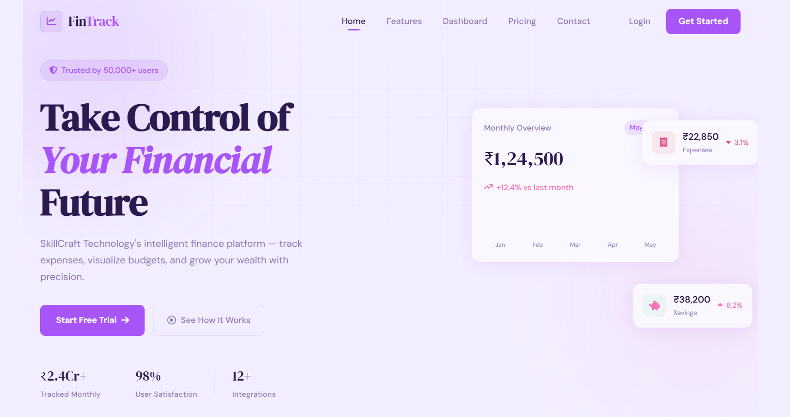
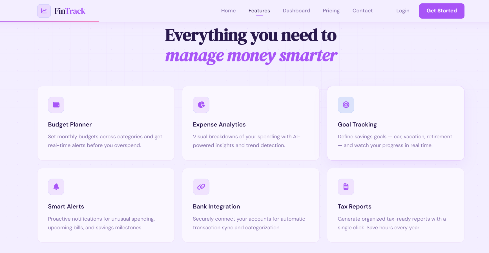
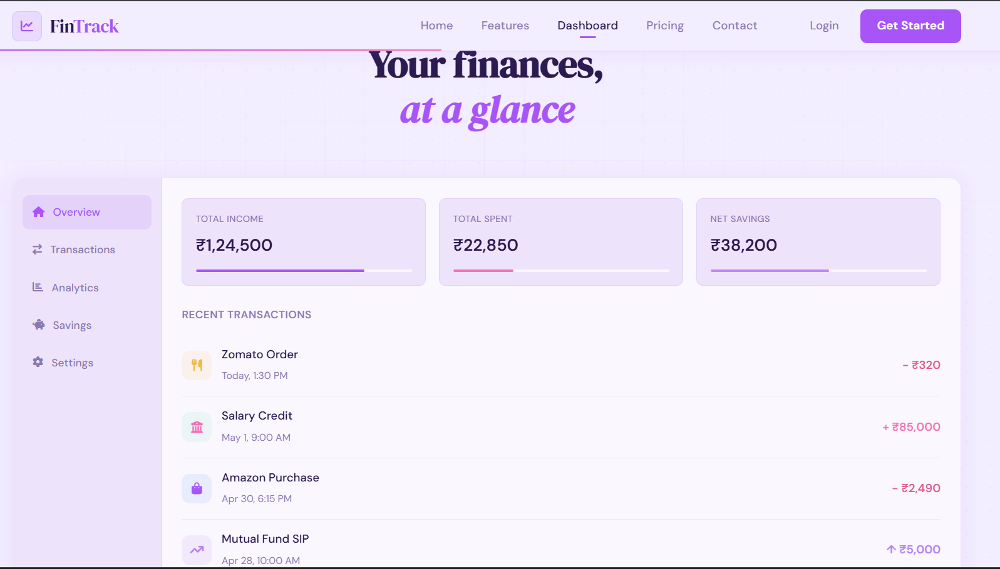
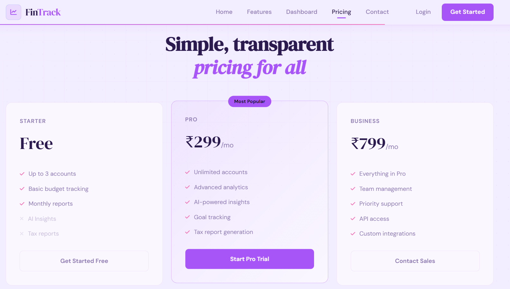
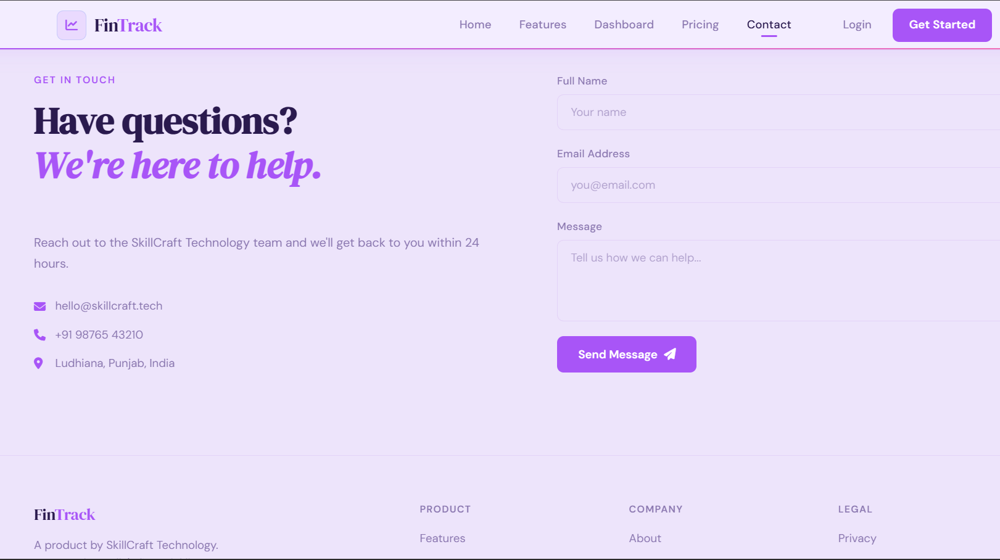

# SCT_WD_1 - Responsive Landing Page

A responsive landing page with an interactive navigation menu built during my Web Development Internship at SkillCraft Technology.

# Task Description
Create a responsive landing page with an interactive navigation menu that:
- Changes color/style when scrolled
- Changes style on hover
- Has a fixed position and is visible on all pages

# Technologies Used
- HTML
- CSS
- JavaScript 

# Features
- Fully responsive design
- Fixed navigation bar
- Smooth scroll effect on navbar
- Hover animations on menu items
- Mobile friendly layout

# Project Structure
SCT_WD_1/
├── index.html
├── style.css
├── script.js
└── README.md

# Live Demo
[Click here to view](https://varinda-aggarwal.github.io/SCT_WD_1/)

# Screenshots

# Author
Varinda Aggarwal
Web Development Intern @SkillCraft Technology

# Connect
- GitHub: [@varinda-Aggarwal](https://github.com/varinda-Aggarwal)
- LinkedIn: [Varinda Aggarwal](https://www.linkedin.com/in/varinda-aggarwal-537101308)
